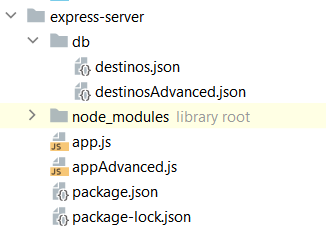
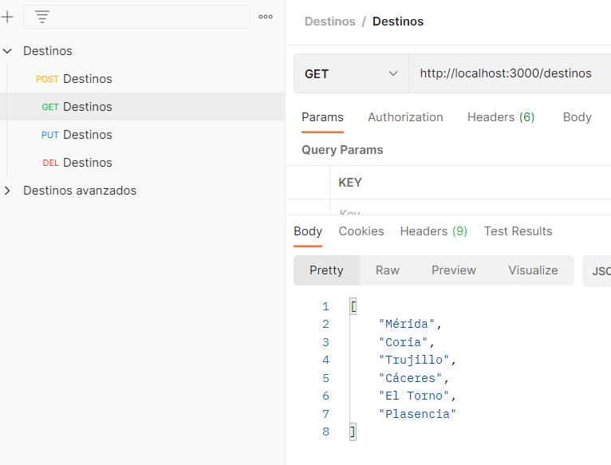
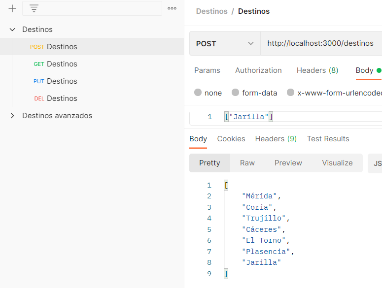
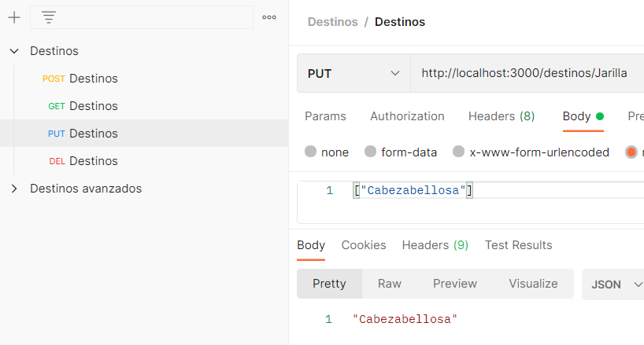
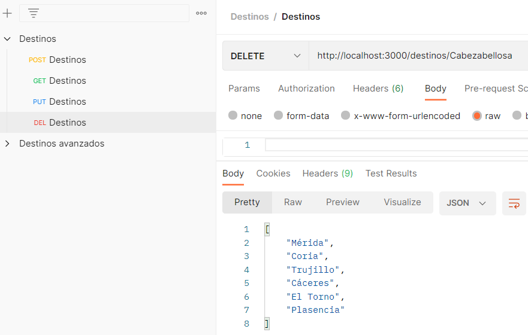

# Sobre el proyecto

Vamos a realizar un ejemplo de configuración de un servidor que devuelve el conjunto de destinos a través de un JSON, esto nos permitirá consultar, crear, modificar y borrar un destino.
Para ello utilizamos **Node** y **Express**.

# Configuración del proyecto

### 1. Creamos una carpeta y accedemos a ella.
```
mkdir express-server
cd express-server
```

### 2. Iniciamos el proyecto con node
```
npm init
```
### 3. Instalamos express (Framework backend de node)
```
npm install express --save
```
### 4. Creamos un fichero donde vamos a almacenar los resultados JSON y añadimos el contenido
```
mkdir db/destinos.json
```
```json
[
  "Mérida",
  "Coria",
  "Trujillo",
  "Plasencia",
  "Cáceres",
  "El Torno"
]

```

### 5. Creamos el archivo **app.js** (servirá la web) con la siguiente información

```js
// Permite escribir en un fichero lo usaremos como base de datos para mantener los cambios
var fs = require("fs");
// Soluciona error CORS
const cors = require('cors');
// Creamos una instancia de express y le decimos que va a usar JSON
var express = require("express");
var app = express();
app.use(express.json());
// Evitar CORS
app.use(cors({
    origin: 'http://localhost:4200'
}));

var url = "/destinos";

// Abrimos el puerto de escucha al 3000 y una vez abierto mostramos un mensaje.
app.listen(3000, () => console.log("El servidor está escuchando en el puerto 3000"));

// Creamos una variable JSON
var destinosFichero = "db/destinos.json";
// Leemos el listado de destinos almacenados en JSON
var misDestinos = JSON.parse(fs.readFileSync(destinosFichero));

// Devolvemos una respuesta sobre una petición GET dinámica
// Parámetros req = request, res = response, next
app.get(url, (req,res,next) => {
    res.json(misDestinos);
});

// Almacenamos un valor de una petición POST
app.post(url, (req,res,next) => {
    // El destino nuevo se introduce en el cuerpo de la petición
    for (const reqElement of req.body) {
        misDestinos.push(reqElement);
    };
    fs.writeFileSync(destinosFichero, JSON.stringify(misDestinos,null,2));
    res.json(misDestinos);
});

// Actualizamos un valor introduciendo su nombre por parámetros
app.put(url+"/:name", (req,res,next) => {
    // :name corresponde con req.params.name
    let nameIndex = misDestinos.indexOf(req.params.name);
    if(nameIndex>= 0 && req.body != null){
        //El parametro a cambiar se introduce en el cuerpo de la petición
        misDestinos[nameIndex] = req.body[0];
    }
    else {
        res.json(["Error"]);
    }
    fs.writeFileSync(destinosFichero,  JSON.stringify(misDestinos,null,2));
    res.json(misDestinos[nameIndex]);
});

// Borramos un valor introduciendo su nombre por parámetros
app.delete(url +"/:name", (req,res,next) => {
    // :name corresponde con req.params.name
    let nameIndex = misDestinos.indexOf(req.params.name);
    if(nameIndex>= 0){
        misDestinos.splice(nameIndex,1);
        fs.writeFileSync(destinosFichero,  JSON.stringify(misDestinos,null,2));
        res.json(misDestinos);
    }
    else {
        res.json(["Error"]);
    }
});
```

### 6. Ejecutamos la apliación

```js
node app.js
```

### 7. La organización de carpetas quedará de la siguiente manera
Para este ejemplo no usamos **destinosAdvanced.json** ni **appAdvanced.js**
> 

### 8. Pruebas con Postman

#### GET
> 
#### POST
> 
#### PUT
> 
#### DEL
> 


[Configuración avanzada](./server_advance.html).