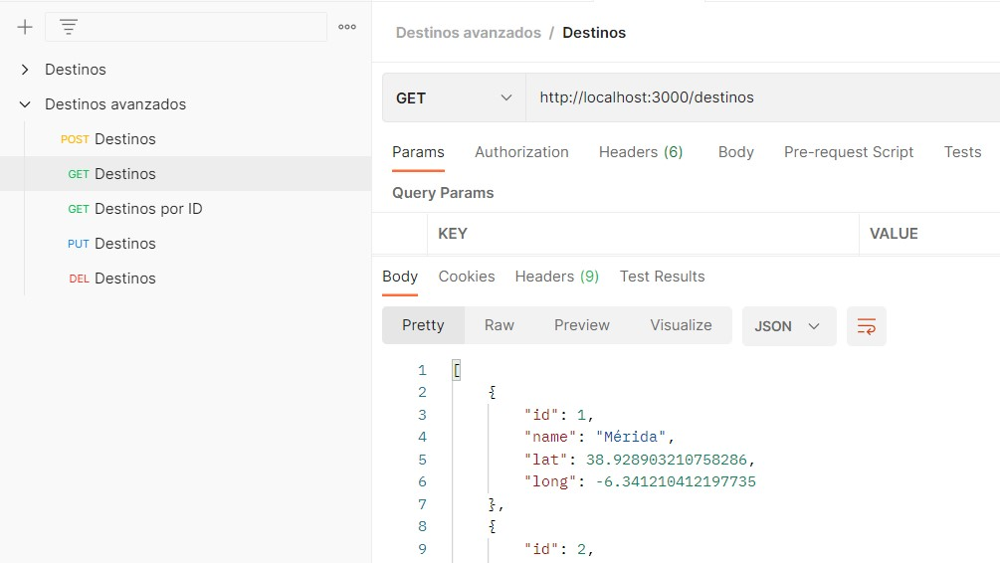
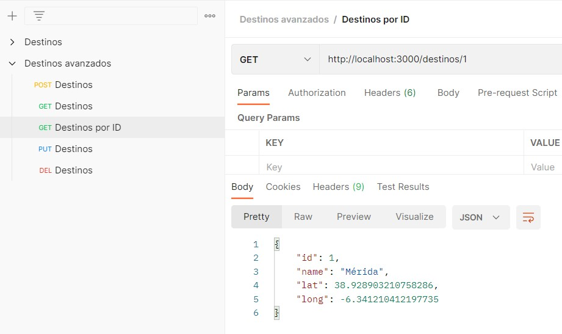
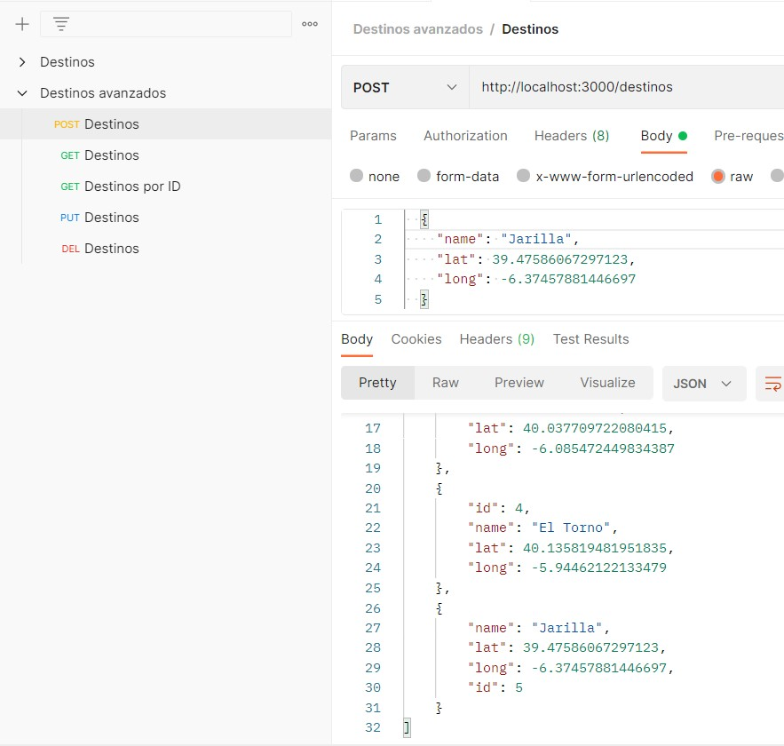
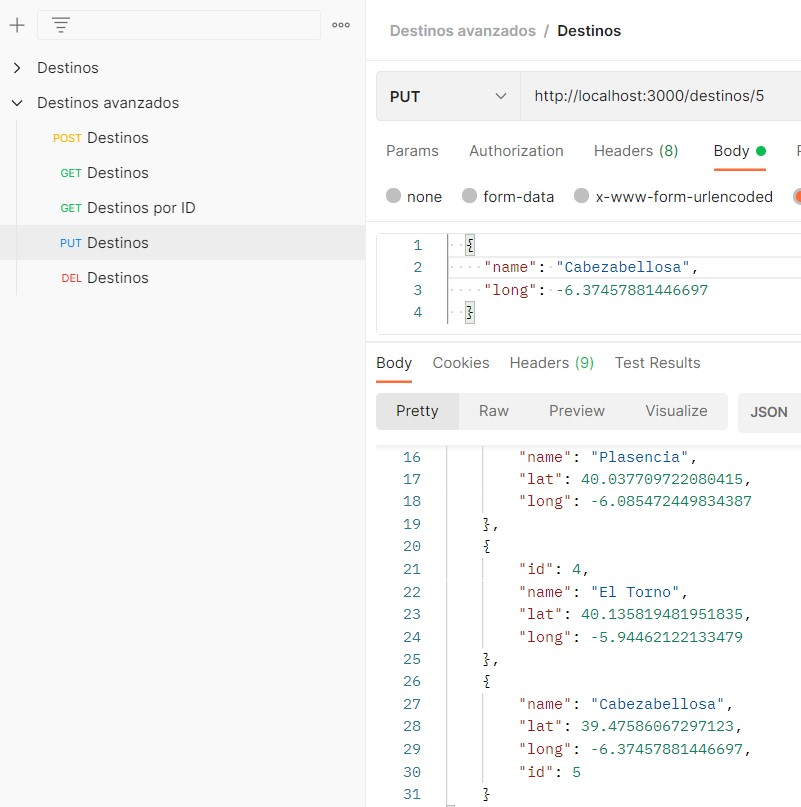
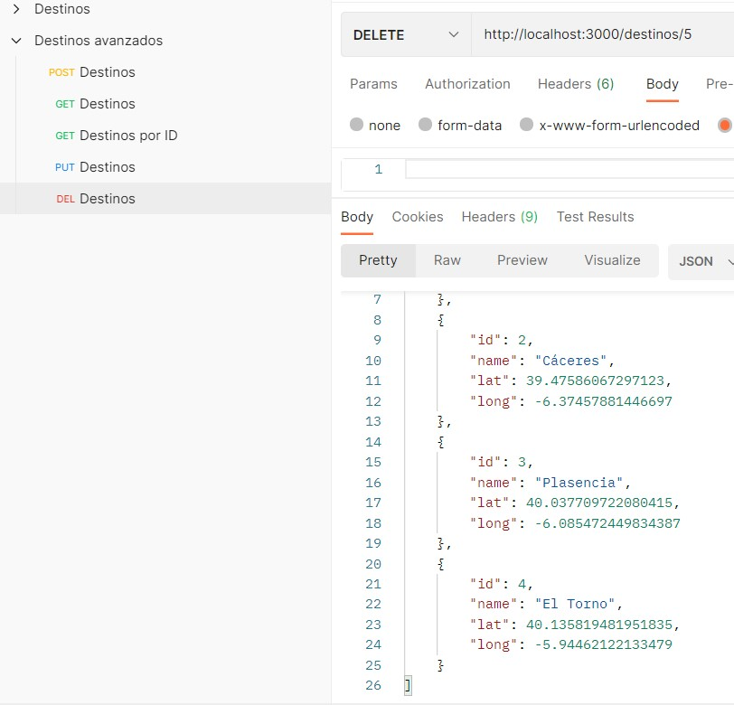

# Configuración avanzada

En este punto vamos a configurar el servidor para que atienda sobre una estructura más avanzada de JSON

### 1. Modificamos el fichero destinos.json donde se almacenarán la inforamción del JSON
```
mkdir db/destinosAdvanced.json
```
Creamos un array de objetos en JSON con los campos **id, name, lat y long**
```json
[
  {
    "id": 1,
    "name": "Mérida",
    "lat": 38.928903210758286,
    "long": -6.341210412197735
  },
  {
    "id": 2,
    "name": "Cáceres",
    "lat": 39.47586067297123,
    "long": -6.37457881446697
  },
  {
    "id": 3,
    "name": "Plasencia",
    "lat": 40.037709722080415,
    "long": -6.085472449834387
  },
  {
    "id": 4,
    "name": "El Torno",
    "lat": 40.135819481951835,
    "long": -5.94462122133479
  }
]

```

### 2. Creamos el archivo **appAdvanced.js** (servirá la web) con la siguiente información

```js
// Permite escribir en un fichero
var fs = require("fs");
// Soluciona error CORS
const cors = require('cors');
// Creamos una instancia de express y le decimos que va a usar JSON
var express = require("express");
var app = express();
app.use(express.json());
// Evitar CORS
app.use(cors({
    origin: 'http://localhost:4200'
}));

// Definimos la url sobre la cual va a responder
var url = "/destinos";

// Abrimos el puerto de escucha al 3000 y una vez abierto mostramos un mensaje.
app.listen(3000, () => console.log("El servidor está escuchando en el puerto 3000"));

// Creamos una variable JSON
var destinosFichero = "db/destinosAdvanced.json";
// Leemos el listado de destinos almacenados en JSON
var misDestinos = JSON.parse(fs.readFileSync(destinosFichero));

// Devolvemos una respuesta sobre una petición GET dinámica
// Parámetros req = request, res = response, next
app.get(url, (req,res,next) => {
    res.json(misDestinos);
});
app.get(url +"/:id", (req,res,next) => {
    res.json(misDestinos.find((x) => req.params.id == x.id));
});

// Almacenamos un valor de una petición POST
app.post(url, (req,res,next) => {
    // El destino nuevo se introduce en el cuerpo de la petición
    reqElement =  req.body;
    // Ordenamos el array, obtenemos el último ID y le incrementamos 1
    misDestinos.sort((x,y) =>{return x.id - y.id});
    let id = misDestinos[misDestinos.length-1].id+1;
    // Asignamos el id
    reqElement.id = id;
    // Ordenamos por id por si estuviesen desordenados
    misDestinos.sort((x,y) =>{return x.id - y.id});
    // Lo aladimos al final.
    misDestinos.push(reqElement);
    fs.writeFileSync(destinosFichero, JSON.stringify(misDestinos,null,2));
    res.json(misDestinos);
});

// Actualizamos un valor introduciendo su nombre por parámetros
app.put(url + "/:id", (req,res,next) => {
    // :id corresponde con req.params.id
    let toUpdate = misDestinos.find((x) => req.params.id == x.id);
    let indexToUpdate = misDestinos.indexOf(toUpdate);

    if(indexToUpdate>= 0) {
        // Recorremos cada uno de los campos y los actualizamos con los que nos vienen en el body
        // Esto nos permite actualizar sólo los datos que nos vengan, si se omite alguno mantiene el que ya estaba.
        for (const x in toUpdate) {
            if (req.body[x]) {
                toUpdate[x] = req.body[x];
            }
        }
        // Actualizamos el elemento
        misDestinos[indexToUpdate]=toUpdate;
        fs.writeFileSync(destinosFichero, JSON.stringify(misDestinos, null, 2));
        res.json(misDestinos);
    }
    else {
        res.json(["Error"]);
    }
});


// Borramos un valor introduciendo su nombre por parámetros
app.delete(url +"/:id", (req,res,next) => {
    // :id corresponde con req.params.id
    let toDelete = misDestinos.find((x) => req.params.id == x.id);
    let indexToDelete = misDestinos.indexOf(toDelete);
    if(indexToDelete>= 0){
        misDestinos.splice(indexToDelete,1);
        fs.writeFileSync(destinosFichero,  JSON.stringify(misDestinos,null,2));
        res.json(misDestinos);
    }
    else {
        res.json(["Error"]);
    }
});
```

### 3. La organización de carpetas quedará de la siguiente manera
Para este ejemplo no usamos **destinos.json** ni **app.js**
> 


### 4. Ejecutamos la apliación

```js
node appAdvanced.js
```

### 5. Pruebas con Postman

#### GET
> 
#### GET por ID
> 
#### POST
> 
#### PUT
> 
#### DEL
> 

[Ir a la página inicial](./index.html).
