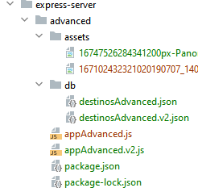
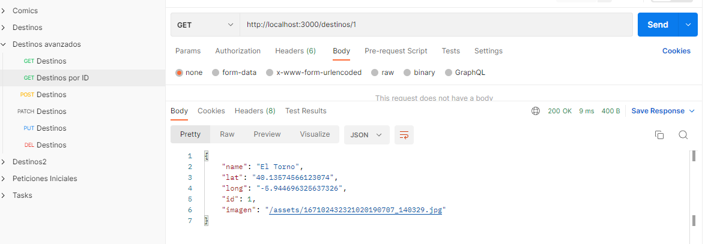
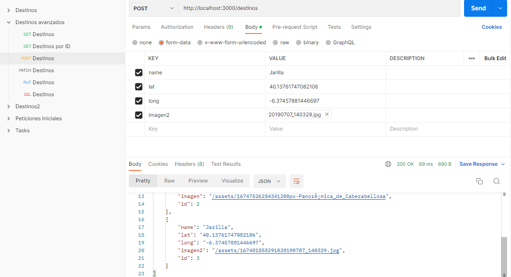
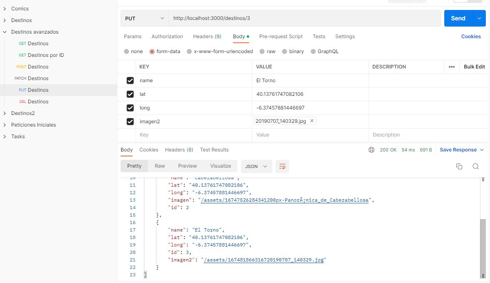
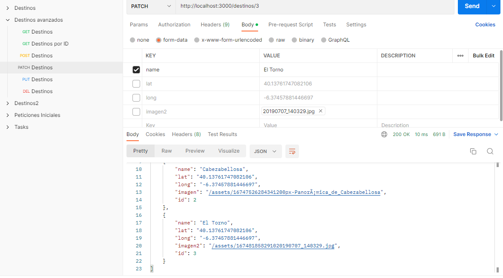
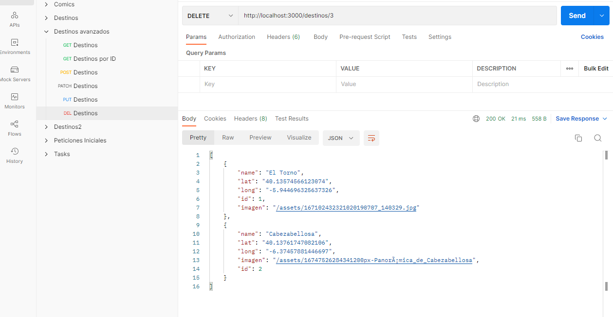

# Configuración avanzada

En este punto vamos a configurar el servidor para que atienda sobre una estructura más avanzada de JSON

### 1. Modificamos el fichero destinos.json donde se almacenarán la inforamción del JSON
```
mkdir db/destinosAdvanced.json
```
Creamos un array de objetos en JSON con los campos **id, name, lat, long e imagen**
```json
[
  {
    "name": "El Torno",
    "lat": "40.13574566123074",
    "long": "-5.944696325637326",
    "id": 1,
    "imagen": "/assets/167102432321020190707_140329.jpg"
  },
  {
    "name": "Cabezabellosa",
    "lat": "40.13761747082106",
    "long": "-6.37457881446697",
    "imagen": "/assets/16747526284341200px-Panorámica_de_Cabezabellosa",
    "id": 2
  }
]

```

### 2. Creamos el archivo **appAdvanced.v2.js** (servirá la web) con la siguiente información

```js
/**
 * @author  Fréderic Sánchez García
 */

// Permite escribir en un fichero
var fs = require("fs");
// Soluciona error CORS
const cors = require('cors');
// Creamos una instancia de express y le decimos que va a usar JSON
var express = require("express");
var app = express();
app.use(express.json());
// Evitar CORS
app.use(cors({
    origin: '*'
}));
// Añadimos el paqeute express-fileupload que nos permitirá obtener los ficheros e indicamos que en las peticiones se va a utilizar
const fileUpload = require('express-fileupload');
app.use(fileUpload());

// Definimos la url sobre la cual va a responder
var url = "/destinos";

// Abrimos el puerto de escucha al 3000 y una vez abierto mostramos un mensaje.
app.listen(3000, () => console.log("El servidor está escuchando en el puerto 3000"));

// Creamos una variable JSON
var destinosFichero = "db/destinosAdvanced.v2.json";
// Leemos el listado de destinos almacenados en JSON
var misDestinos = JSON.parse(fs.readFileSync(destinosFichero));

// Devolvemos una respuesta sobre una petición GET dinámica
// Parámetros req = request, res = response, next
app.get(url, (req,res,next) => {
    res.json(misDestinos);
});
app.get(url +"/:id", (req,res,next) => {
    res.json(misDestinos.find((x) => req.params.id == x.id));
});
app.get(url +"/?search=:name", (req,res,next) => {
    res.json(misDestinos.find((x) => req.params.name == x.name));
});
// Almacenamos un valor de una petición POST y hacemos que funcione como PUT
app.post(url,  (req,res,next) => {
    // El destino nuevo se introduce en el cuerpo de la petición
    reqElement =  req.body;
    // Ordenamos el array, obtenemos el último ID y le incrementamos 1
    misDestinos.sort((x,y) =>{return x.id - y.id});
    let id = misDestinos[misDestinos.length-1].id+1;
    // Comprobamos si vien fichero y lo añadimos
    //https://github.com/richardgirges/express-fileupload/tree/master/example
    if (req.files && Object.keys(req.files).length !== 0) {
        for (const keyFiles of Object.keys(req.files)) {
            // Obtenemos la fecha para añadirlo a la imagen y que no se sobrescriba en caso de haber una con el mismo nombre.
            let num = new Date();
            sampleFile = req.files[keyFiles];
            let fileName = num.getTime()+ req.files[keyFiles].name;
            var uploadPath = __dirname+ '/assets/' +fileName;
            sampleFile.mv(uploadPath, function(err) {
                if (err){
                    console.log(err);
                }
            });
            reqElement[keyFiles] = '/assets/'+fileName;
        }
    }
    // Asignamos el id
    reqElement.id = id;
    // Ordenamos por id por si estuviesen desordenados
    misDestinos.sort((x,y) =>{return x.id - y.id});
    misDestinos.push(reqElement);
    fs.writeFileSync(destinosFichero, JSON.stringify(misDestinos,null,2));
    res.json(misDestinos);
});

// Sustituye un valor introduciendo su nombre por parámetros
// Sustituye todo el contenido introducido por lo que hubiese antes.
app.put(url + "/:id", (req,res,next) => {
    // :id corresponde con req.params.id
    let indexToUpdate = misDestinos.indexOf(misDestinos.find((x) => req.params.id == x.id));

    // El destino nuevo se introduce en el cuerpo de la petición
    reqElement =  req.body;
    reqElement.id = misDestinos[indexToUpdate].id;

    if(indexToUpdate>= 0) {
        if (req.files && Object.keys(req.files).length !== 0) {
            for (const keyFiles of Object.keys(req.files)) {
                // Obtenemos la fecha para añadirlo a la imagen y que no se sobrescriba en caso de haber una con el mismo nombre.
                let num = new Date();
                sampleFile = req.files[keyFiles];
                let fileName = num.getTime()+ req.files[keyFiles].name;
                var uploadPath = __dirname+ '/assets/' +fileName;
                sampleFile.mv(uploadPath, function(err) {
                    if (err){
                        console.log(err);
                    }
                });
                reqElement[keyFiles] = '/assets/'+fileName;
            }
        }
        // Actualizamos el elemento
        misDestinos[indexToUpdate]=reqElement;
        fs.writeFileSync(destinosFichero, JSON.stringify(misDestinos, null, 2));
        res.json(misDestinos);
    }
    else {
        res.status(404).send('Error');
    }
});


// Actualizamos un valor introduciendo su nombre por parámetros
// Actualiza todo el contenido introducido.
app.patch(url + "/:id", (req,res,next) => {
    // :id corresponde con req.params.id
    let toUpdate = misDestinos.find((x) => req.params.id == x.id);
    let indexToUpdate = misDestinos.indexOf(toUpdate);

    if(indexToUpdate>= 0) {
        // Recorremos cada uno de los campos y los actualizamos con los que nos vienen en el body
        // Esto nos permite actualizar sólo los datos que nos vengan, si se omite alguno mantiene el que ya estaba.
        for (const x in toUpdate) {
            if (req.body[x]) {
                toUpdate[x] = req.body[x];
            }
        }
        if (req.files && Object.keys(req.files).length !== 0) {
            for (const keyFiles of Object.keys(req.files)) {
                // Obtenemos la fecha para añadirlo a la imagen y que no se sobrescriba en caso de haber una con el mismo nombre.
                let num = new Date();
                sampleFile = req.files[keyFiles];
                let fileName = num.getTime()+ req.files[keyFiles].name;
                var uploadPath = __dirname+ '/assets/' +fileName;
                sampleFile.mv(uploadPath, function(err) {
                    if (err){
                        console.log(err);
                    }
                });
                toUpdate[keyFiles] = '/assets/'+fileName;
            }
        }
        // Actualizamos el elemento
        misDestinos[indexToUpdate]=toUpdate;
        fs.writeFileSync(destinosFichero, JSON.stringify(misDestinos, null, 2));
        res.json(misDestinos);
    }
    else {
        res.status(404).send('Error');
    }
});

// Borramos un valor introduciendo su nombre por parámetros
app.delete(url +"/:id", (req,res,next) => {
    // :id corresponde con req.params.id
    let toDelete = misDestinos.find((x) => req.params.id == x.id);
    let indexToDelete = misDestinos.indexOf(toDelete);
    if(indexToDelete>= 0){
        misDestinos.splice(indexToDelete,1);
        fs.writeFileSync(destinosFichero,  JSON.stringify(misDestinos,null,2));
        res.json(misDestinos);
    }
    else {
        res.status(404).send('Error');
    }
});

// Permitimos el acceso a la carpeta assets
app.use('/assets', express.static('assets'))
```

### 3. La organización de carpetas quedará de la siguiente manera
Para este ejemplo no usamos **destinos.json** ni **app.js**
> 

### 4. Ejecutamos la apliación

```js
node appAdvanced.v2.js
```

### 5. Pruebas con Postman

#### GET
> ![get_appAdvanced.jpg](./assets/images/appAdvanced/get_appAdvanced.jpg)
#### GET por ID
> 
#### POST
> 
#### PUT
> 
#### PATCH
> 
#### DEL
> 

[Ir a la página inicial](./index.html).
